# Art-Style-Transfer-using-TensorFlow
Neural Art Style Transfer based on [Gatys et al.](https://arxiv.org/abs/1508.06576)

**Contents**
- About
- Classes
- Scripts
- Executables
- Outputs
  1. Columbia University Low Library - Van Gogh Starry Night
  2. Mozart - Van Gogh - Portrait
  3. Horse - Kandinsky

**About** 
This is a fun project that I have undertaken because of my fascination in style transfer techniques. The project is based on the original [Gatys et al.](https://arxiv.org/abs/1508.06576) paper.
Some of the code for the project is inspired from the TensorFlow tutorials. My inspiration for this project is from the "Convolutional Neural Networks" course offered by deeplearning.ai on Coursera taught by Dr. Andrew NG.
Although more sophisticated techniques and algorithms for neural style transfer are available today, I wanted to try these techniques for myself and visualize the resulting stylized outputs.

**Classes**
- BuildModel : Class to build the VGG model and extract layers and outputs of content and style images processed from the VGG model and Gram matrix
- DefineRepresentations : Class to initialize the style and content layers from the VGG19 model

**Scripts**
- ImagePreprocessing : Several utility and helper functions for preprocessing, scaling, loading, and display of input and output images

**Executables**
- TrainModel : Regularizing input images, defining loss function, defining training step and hyperparametrs, and training to get stylized output image

**Outputs**
- **Columbia University Low Library - Van Gogh Starry Night**
  - Parameters :
    1. Total variation weight = 30
    2. Style weight = 5e-2
    3. Content weight = 1e4
    4. Epochs = 25
    5. Steps per epoch = 100
    6. optimizer = Adam(learning rate = 0.005, beta_1 = 0.99, epsilon = 1e-1)
  - Input Images :
    - Content Image :
      
    - Style Image :
      
  - Rescaled Images :
    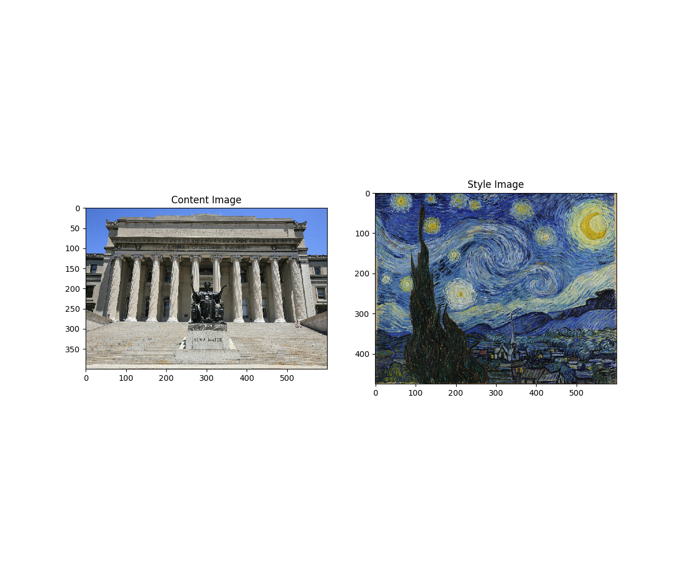
  - Output Images : 
    Epoch 1 &emsp; &emsp; &emsp; &emsp; &emsp; &emsp; &emsp; &emsp; &emsp; &emsp; &emsp; &emsp; &emsp; &emsp; &emsp; &nbsp; &nbsp; &nbsp; Epoch 5  
    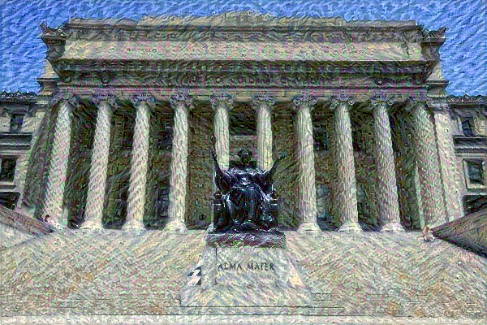 &nbsp; &nbsp; &nbsp; &nbsp; 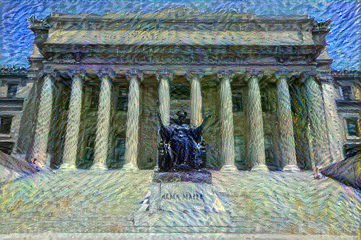   
    Epoch 10 &emsp; &emsp; &emsp; &emsp; &emsp; &emsp; &emsp; &emsp; &emsp; &emsp; &emsp; &emsp; &emsp; &emsp; &emsp; &nbsp; &nbsp; Epoch 15  
    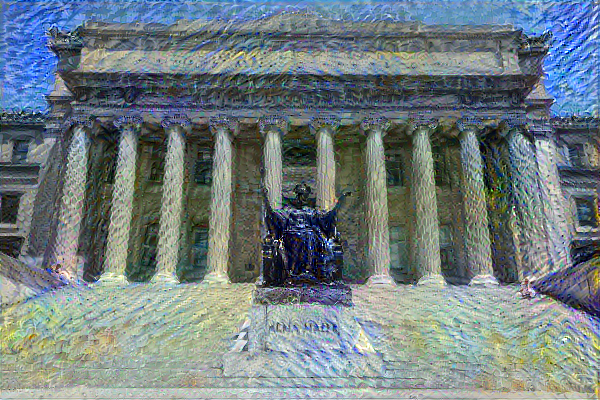 &nbsp; &nbsp; &nbsp; &nbsp; 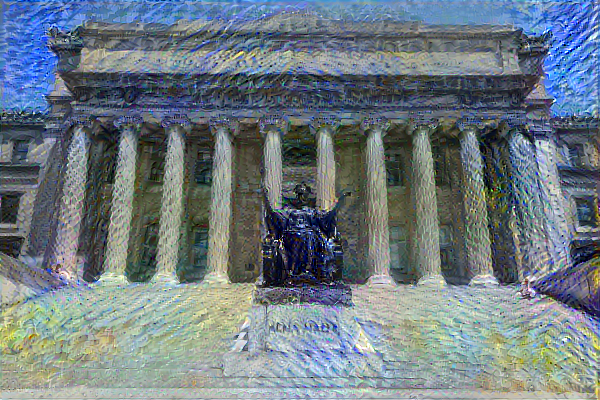   
    Epoch 20 &emsp; &emsp; &emsp; &emsp; &emsp; &emsp; &emsp; &emsp; &emsp; &emsp; &emsp; &emsp; &emsp; &emsp; &emsp; &nbsp; &nbsp; Epoch 25  
    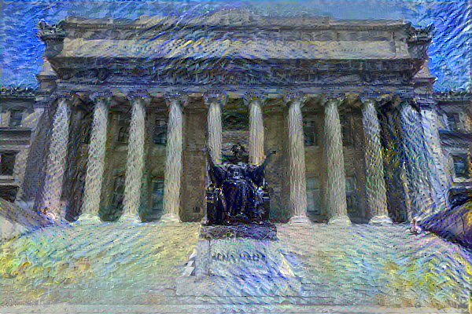 &nbsp; &nbsp; &nbsp; &nbsp;    
  - Stylized Image :  
    
- **Mozart - Van Gogh - Portrait**
  - Parameters :
    1. Total variation weight = 30
    2. Style weight = 5e-2
    3. Content weight = 1e4
    4. Epochs = 25
    5. Steps per epoch = 100
    6. optimizer = Adam(learning rate = 0.005, beta_1 = 0.99, epsilon = 1e-1)
  - Input Images :
    - Content Image :  
      
    - Style Image :  
      
  - Rescaled Images :  
    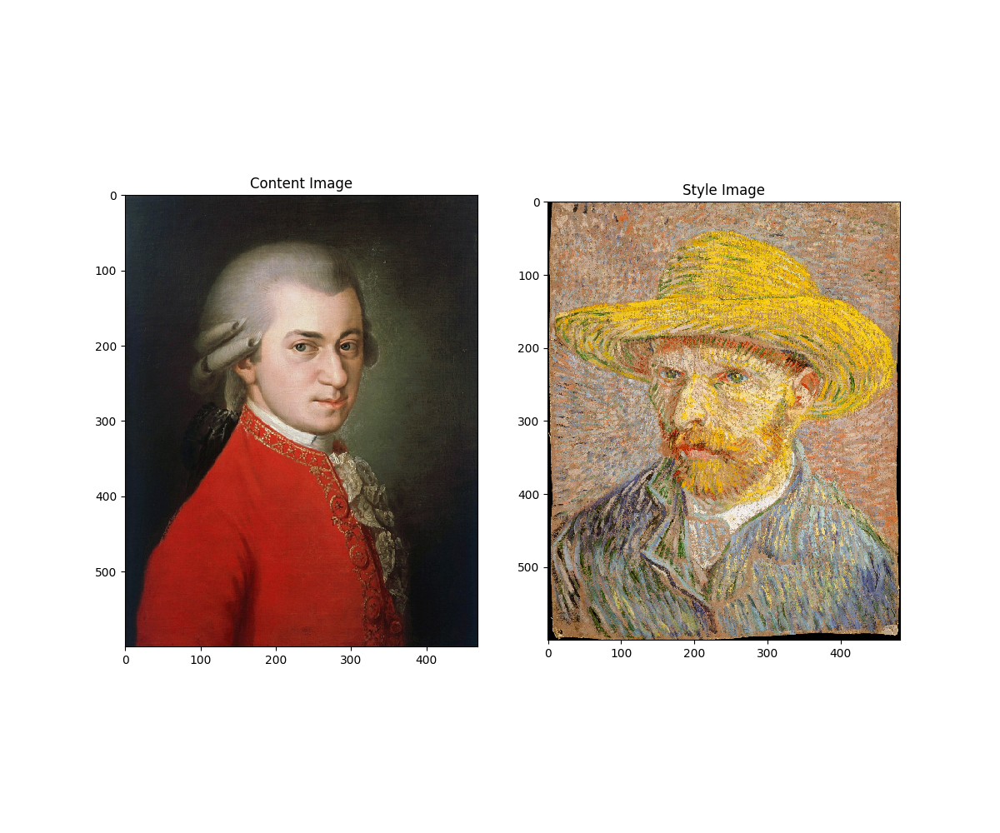
  - Stylized Image :  
    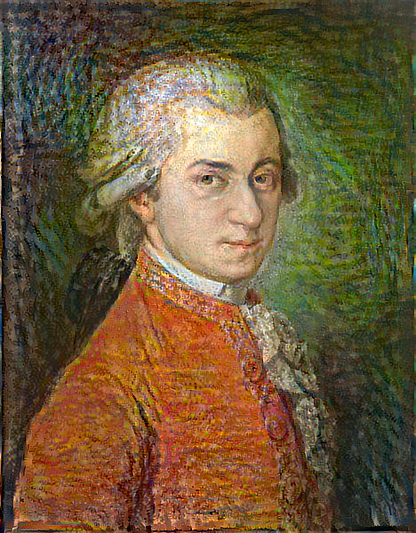
- **Horse - Kandinsky**
  - Parameters :
    1. Total variation weight = 30
    2. Style weight = 5e-2
    3. Content weight = 1e4
    4. Epochs = 25
    5. Steps per epoch = 100
    6. optimizer = Adam(learning rate = 0.005, beta_1 = 0.99, epsilon = 1e-1)
  - Input Images :
    - Content Image :  
      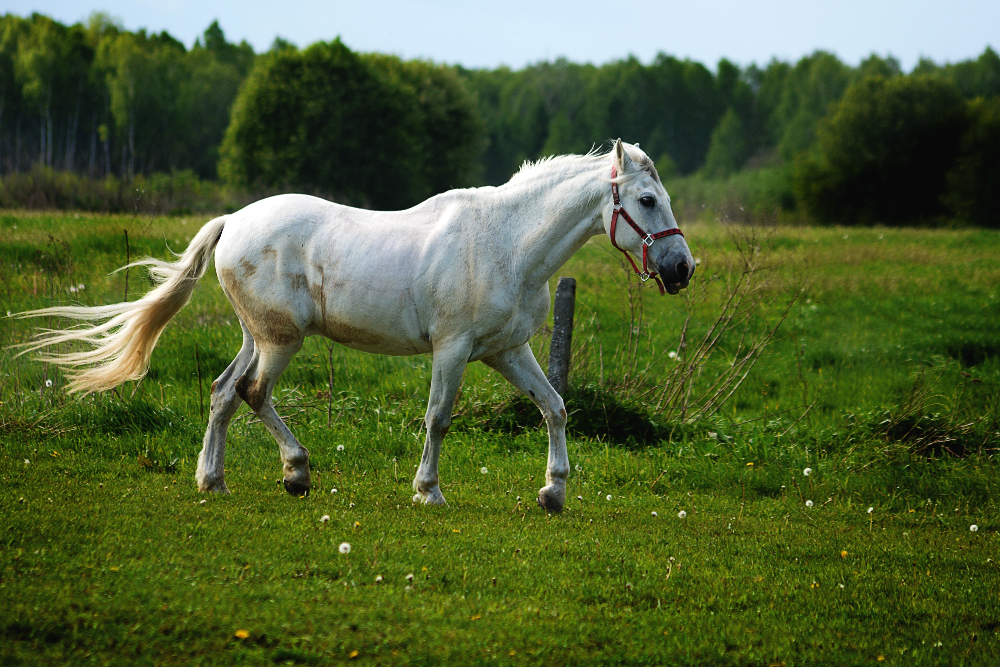
    - Style Image :  
      
  - Rescaled Images :  
    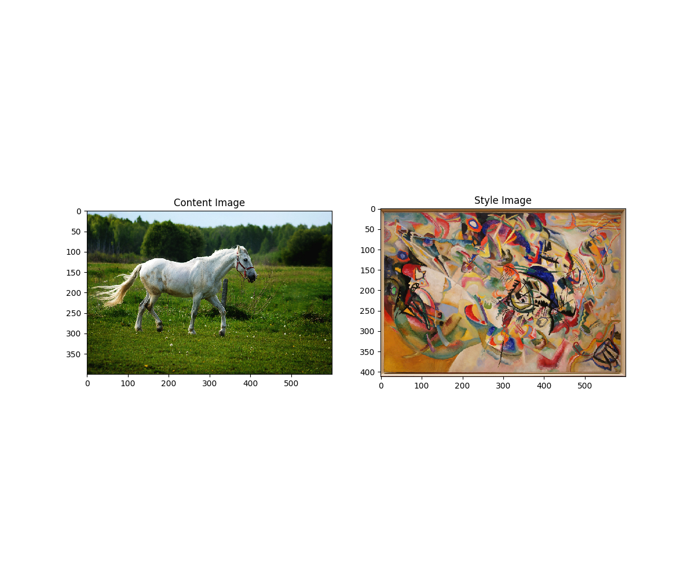
  - Stylized Image :  
    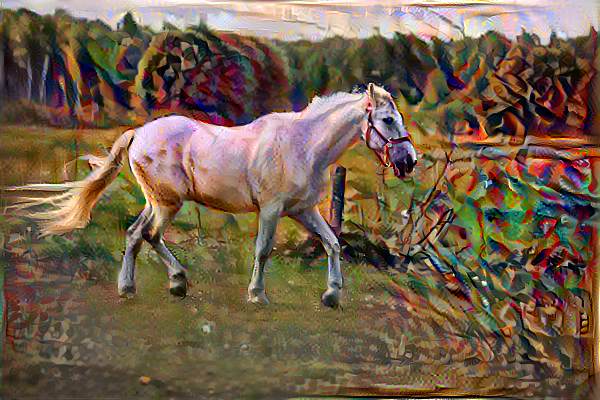
